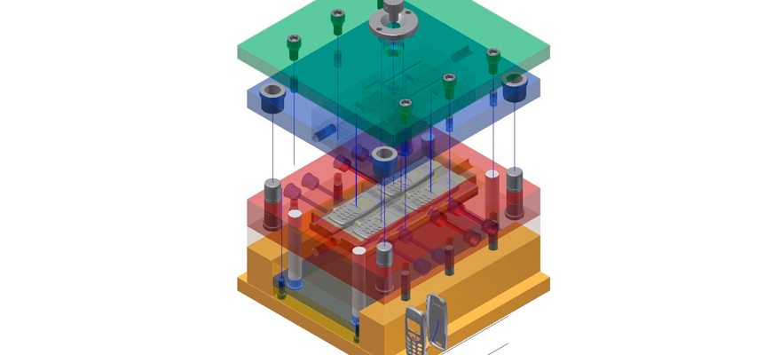

# _Controle 3D_

---

Este repositório é dedicado à gestão de projetos CAD e contém uma estrutura de pastas organizada para facilitar o trabalho com desenhos, componentes, placas eletrônicas e montagens. Além disso, incluímos um sistema de versionamento para acompanhar as mudanças nas peças e recursos do projeto.

## Sumário

- [Histórico de Versão](#histórico-de-versão)
- [Estrutura de Pastas](#estrutura-de-pastas)
- [Versionamento](#versionamento)
- [Vídeo de Exemplo](#vídeo-de-exemplo)
- [Resumo](#resumo)
- [Objetivo](#objetivo)
- [Requisitos](#requisitos)

## Histórico de Versão

| Versão | Data       | Autor        | Descrição            |
|--------|------------|--------------|----------------------|
| 1.0.0  | 18/08/2025 | Adenilton R  | Início do Projeto    |

---

## Estrutura de Pastas

A seguir, descrevemos a estrutura de pastas que você encontrará neste repositório:

- **Componentes Externos**: Aqui estão armazenados arquivos de download, importações e outros recursos relacionados a componentes externos que fazem parte do projeto.

- **DXFs**: Esta pasta contém os arquivos DXF gerados para várias finalidades, como placas eletrônicas, cortes a laser, referências para outras peças e muito mais.

- **Eletrônica**: Nesta pasta, você encontrará as placas eletrônicas exportadas de ferramentas como KiCad, Proteus e outras.

- **Montagens**: Todas as submontagens do projeto estão organizadas aqui, incluindo a montagem principal. Cada submontagem possui sua própria subpasta para uma organização eficaz.

- **Peças**: Todas as peças do projeto estão organizadas nesta pasta. Elas são separadas em subpastas que correspondem a partes específicas do projeto. Se houver peças que não se enquadram em nenhuma parte específica, elas são armazenadas na pasta "Peças Gerais".

## Versionamento

Durante o desenvolvimento do projeto, é essencial manter um sistema de versionamento para controlar as mudanças nas peças. Aqui estão as diretrizes para o versionamento:

- **Alterações Drásticas**: Se uma peça precisar passar por mudanças drásticas, você deve criar uma nova configuração da peça. Isso envolve atribuir a modificação de cota à configuração existente ou adicionar um novo recurso à peça. Isso permite manter um histórico claro das diferentes versões da peça.

- **Supressão de Recursos**: Se você suprimir recursos em uma peça, documente essa ação e a razão para a supressão. Isso ajuda a entender as mudanças feitas na peça.

## Vídeo de Exemplo

Para uma demonstração prática da estrutura de pastas e do sistema de versionamento, você pode assistir a este vídeo de exemplo: [Vídeo de Exemplo](https://www.youtube.com/watch?v=cV3SEz02TX0&ab_channel=RenderCursos).

Este README fornece uma visão geral da organização deste repositório e das práticas recomendadas para o versionamento de peças CAD. Certifique-se de seguir essas diretrizes ao trabalhar em projetos CAD neste repositório.

---

## Resumo

[Descrição resumida do projeto.]

## Objetivo

[Descrição dos objetivos do projeto.]

## Requisitos

[Liste os requisitos do projeto, como hardware, software ou outros pré-requisitos.]