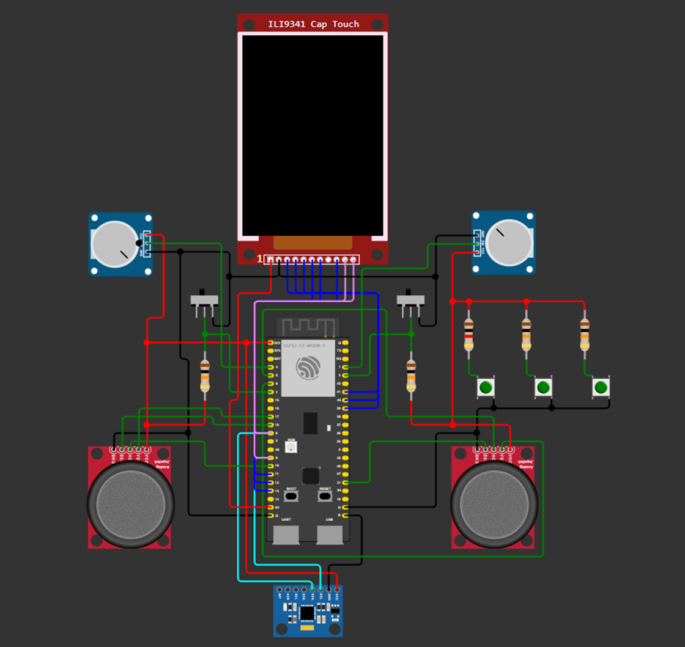

# _Firmware controle personalizado_

---

## Sumário

- [Histórico de Versão](#histórico-de-versão)
- [Resumo](#resumo)
- [Objetivo](#objetivo)
- [Simulador](#simulador)
- [Links para estudos](#links-para-estudos)
- [Fluxograma](#fluxograma)
- [Pinos do projeto eletrônico](#pinos-do-projeto-eletrônico)
- [Bibliotecas](#bibliotecas)
- [Configuração do microcontrolador](#configuração-do-microcontrolador)
- [Configuração do Firmware](#configuração-do-firmware)
- [Informações](#informações)

## Histórico de versão

| Versão | Data       | Autor        | Descrição            |
|--------|------------|--------------|----------------------|
| 1.0.0  | 18/08/2025 | Adenilton R  | Início do Projeto    |

## Resumo

Este projeto contempla o desenvolvimento de um firmware embarcado para um controle personalizado baseado no microcontrolador ESP32-S3. O sistema utiliza o framework da Espressif com FreeRTOS, permitindo a execução de múltiplas tarefas em tempo real.

O controle contará com diversos dispositivos de entrada, incluindo botões, potenciômetros, joysticks e chaves, além de um display LCD touch de 2.8” com interface gráfica desenvolvida utilizando LVGL. Também será integrado um sensor MPU para leitura de movimento.

A comunicação será feita por múltiplas interfaces, como USB, Bluetooth (BLE), Wi-Fi e RF 2.4 GHz, possibilitando o uso do controle em diferentes aplicações.

## Objetivo

Desenvolver um firmware robusto, modular e escalável para um controle multifuncional, capaz de operar em diferentes cenários, como controle de robôs, drones, sistemas de automação e simuladores de voo no PC.

O projeto tem como foco:

- Utilização do FreeRTOS para gerenciamento eficiente de tarefas
- Integração de múltiplos dispositivos de entrada e sensores
- Implementação de comunicação sem fio e via USB
- Criação de uma interface gráfica intuitiva utilizando LVGL
- Flexibilidade para adaptação a diferentes aplicações e protocolos

## Simulador

Para este projeto, estamos utilizando o simulador Wokwi. Para acessar o simulador, basta criar uma conta no site do [**`Wokwi`**](https://wokwi.com/) e seguir as instruções para integrar o simulador ao [**`VS Code`**](https://docs.wokwi.com/pt-BR/vscode/getting-started).

**Opções de Simulação:**

[**`Kit completo online:`**](https://wokwi.com/projects/461603168688413697) Acesse o simulador diretamente pelo navegador e use o kit completo online.

[**`Kit completo VS Code:`**](https://github.com/AdeniltonR/Controle-personalizado/tree/master/Firmware/Simulador/kit-completo) Para uma experiência integrada no VS Code, instale a extensão Wokwi e configure o ambiente localmente para simulação.

## Links para estudos

[Datasheet ESP32-S3.](https://br.mouser.com/datasheet/2/891/esp32_s3_wroom_1_wroom_1u_datasheet_en-2930317.pdf)

[ESP32-S3-DevKitC-1 v1.1.](https://docs.espressif.com/projects/esp-idf/en/latest/esp32s3/hw-reference/esp32s3/user-guide-devkitc-1.html)

[Pinout ESP32-S3.](https://www.studiopieters.nl/esp32-s3-wroom-pinout/)

[JTAG documentação.](https://docs.espressif.com/projects/esp-idf/en/stable/esp32s3/api-guides/jtag-debugging/index.html)

## Fluxograma

`[Adicionar uma imagem]`

## Pinos do projeto eletrônico

`[Adicionar uma imagem]`

`Link`para do esquemático eletrônico - KiCad

## Bibliotecas

`[Adicionar uma imagem]`

`Link`para adicionar

## Configuração do microcontrolador

`[Adicionar uma imagem]`

## Configuração do Firmware

`[Adicionar uma imagem]`

[Descrisão ou configuração do projeto...]

## Informações

| Info             | Modelo                   |
|------------------|--------------------------|
| uC               | ESP32-S3                 |
| Placa            | ESP32-S3 Dev Module      |
| Arquitetura      | Xtensa / RISC            |
| IDE              | IDF v5.4.0               |