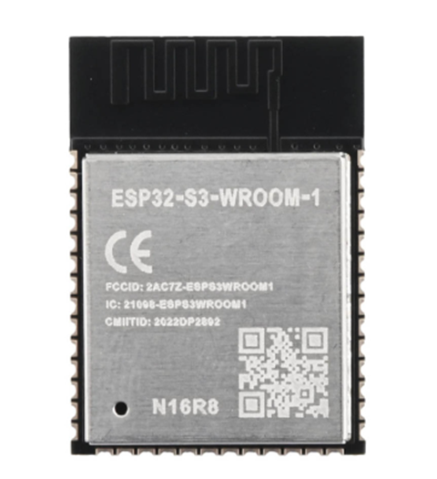
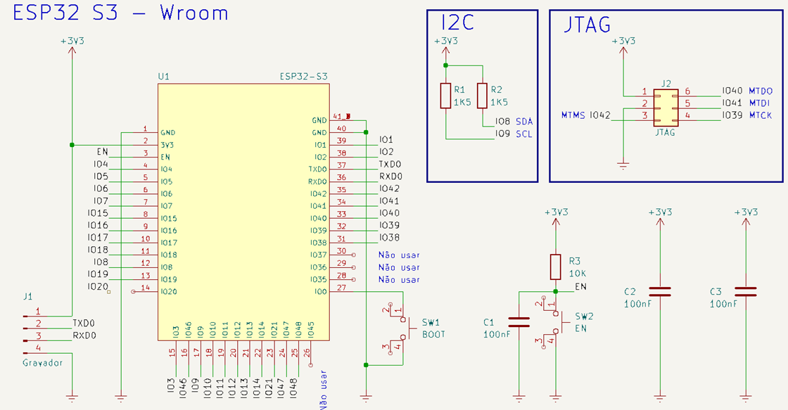

# _Nome do Projeto_

---

## Sumário

- [Histórico de Versão](#histórico-de-versão)
- [Resumo](#resumo)
- [Arquivos Gerber](#arquivos-gerber)
- [3D](#3d)
- [Cabeçalho do Projeto](#cabeçalho-do-projeto)
- [Links para estudos e datasheet](#links-para-estudos-e-datasheet)
- [Diagrama de Bloco](#diagrama-de-bloco)
- [Pinos do projeto eletrônico](#pinos-do-projeto-eletrônico)
- [Explicação dos módulos eletrônico](#explicação-dos-módulos-eletrônico)
  - [Nome do módulo](#nome-do-módulo)
- [Informações do Software](#informações-do-software)

## Histórico de versão

| Versão | Data       | Autor        | Descrição            |
|--------|------------|--------------|----------------------|
| 1.0.0  | 11/09/2024 | Adenilton R  | Início do Projeto    |

## Resumo

[Descrição resumida do projeto.]

## Arquivo Gerber

**`nome_do projeto_v1.0.0`**

## 3D

⚙️**Confira a versão ao vivo!**

`[Gif]`

Top:

`[Adicionar uma imagem frente e verso]`

Bottom

`[Adicionar uma imagem frente e verso]`

## Cabeçalho do Projeto

`[Adicionar uma imagem]`

## Links para estudos e datasheet

`Link`para adicionar

`Link`para adicionar

## Diagrama de Bloco

Este é o diagrama do projeto eletrônico, onde estarão contidos todos os circuitos necessários para o funcionamento adequado.

`[Adicionar uma imagem]`

## Pinos do projeto eletrônico

`[Adicionar uma imagem]`

`Esquemático eletrônico - KiCad.`

## Explicação dos módulos eletrônico

### ESP32-S3

O Módulo ESP32-S3, é um módulo ESP32 da Série S3 que possuí maior quantidade de memória flash com 16 MB, e também maior quantidade de PSRAM, com 8MB. Perfeito para situações que necessitam de processamento e maior quantidade de armazenamento. Além disso, esse módulo também consegue conectar-se a internet via protocolo WiFi 802.11 b/g/n e ao Bluetooth com a conexão bluetooth 5.0.

Esquemático eletrônico.

**Informações Técnicas:**

- `Modelo:` ESP32-S3-WROOM-1 N16R8;
- `CPU:` Xtensa® Dual-Core 32-bit LX7 / ESP32-S3-WROOM-1-N16R8;
- `Clock:` 240MHz;
- `Conectividade sem fio WiFI:` WiFi 802.11 b/g/n;
- `Conectividade sem fio bluetooth:` Bluetooth 5.0 + BT mesh;
- `Memória Flash:` 16MB;
- `Memória PSRAM:` 8MB;
- `Memória SRAM:` 512 Kbytes;
- `Memória ROM:` 384 KBytes;
- `Tensão de operação:` 3V à 3.6V;
- `Temperatura de operação:` -40° até 65°C;

**Pinos JTAG:**

| Conector | Nome | Pino  |
|----------|------|-------|
| 1        | VDD  | +3.3V |
| 2        | GND  | 0V    |
| 5        | MTDI | IO41  |
| 4        | MTCK | IO39  |
| 6        | MTDO | IO40  |
| 3        | MTMS | IO42  |

**Documetação:**

[Compra BR.](https://curtocircuito.com.br/modulo-esp32-s3-esp32-s3-wroom-1-n16r8.html)

[Compra na Mouser, preço está em $3,48.](https://br.mouser.com/ProductDetail/Espressif-Systems/ESP32-S3-WROOM-1-N16?qs=Li%252BoUPsLEntjPrtJwwS5Pw%3D%3D&gad_source=1&gclid=Cj0KCQiA5rGuBhCnARIsAN11vgSUrklRz54ksZWJaJwZxlhjXskfNkuu7xYtAcr24JxHQoZzoAZstzIaAstoEALw_wcB)

[Datasheet ESP32-S3.](https://br.mouser.com/datasheet/2/891/esp32_s3_wroom_1_wroom_1u_datasheet_en-2930317.pdf)

[ESP32-S3-DevKitC-1 v1.1.](https://docs.espressif.com/projects/esp-idf/en/latest/esp32s3/hw-reference/esp32s3/user-guide-devkitc-1.html)

[Pinout ESP32-S3.](https://www.studiopieters.nl/esp32-s3-wroom-pinout/)

[JTAG documentação.](https://docs.espressif.com/projects/esp-idf/en/stable/esp32s3/api-guides/jtag-debugging/index.html)

**Informações para KiCad:**

ESP32_S3_WROOM_1_N16
Bluetooth, WiFi 802.11b/g/n, Bluetooth v5.0 Transceiver Module 2.4GHz PCB Trace Surface Mount

Link de arquivos do ESP32-S3:

[SnapEda](https://www.snapeda.com/parts/ESP32S3WROOM1N16R8/Espressif%20Systems/view-part/?ref=search&t=ESP32-S3-WROOM-1-N16)

### Nome do módulo

[Fazer descrição]

`[Adicionar uma imagem]`

Esquemático eletrônico.

`[Adicionar uma imagem]`

**Informações Técnicas:**

- `Tensão de operação:` 3,3V - 5V;
- `Chip:` DS3231;

**Pinos do projeto:**

| Nome | Pino |
|------|------|
| SDA  | D21  |
| SCL  | D22  |

**Documetação:**

`Link` de compra do módulo.

`Link` do datasheet.

**Informações para KiCad:**

Nome_do_componente

Diodo Retificador Schottky SS34 40v 3a SMD

Link de arquivos do SS34:

[SnapEDA](https://www.snapeda.com/parts/SS34/Taiwan%20Semiconductor/view-part/?ref=search&t=ss34)

## Informações do Software

| Info             | Modelo                     |
|------------------|----------------------------|
| KiCad            | 8.0.0                      |

