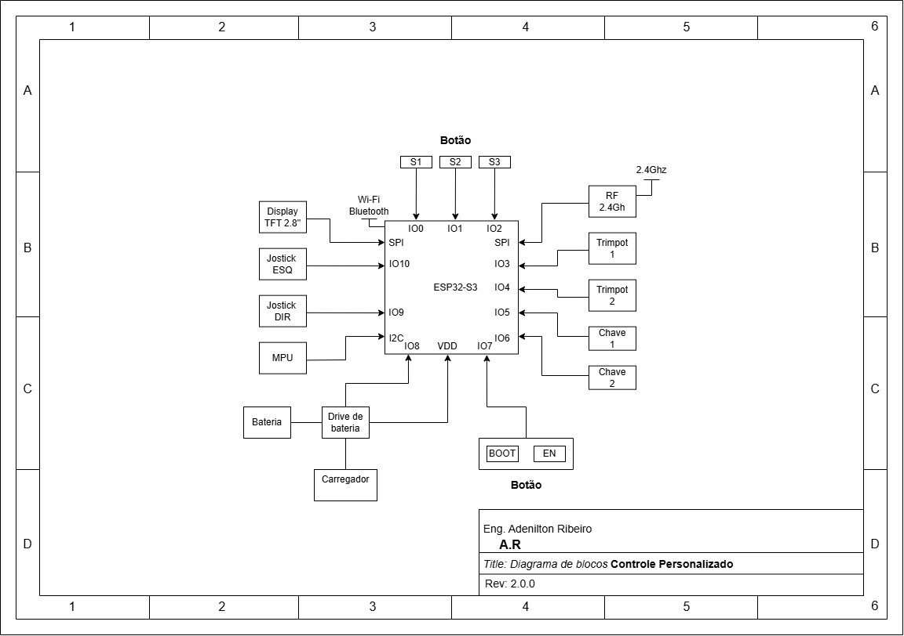

# _Hardware Controle_

---

## Sumário

- [Histórico de Versão](#histórico-de-versão)
- [Resumo](#resumo)
- [Arquivos de fabricação](#arquivos-de-fabricação)
- [3D](#3d)
- [Cabeçalho do Projeto](#cabeçalho-do-projeto)
- [Links para estudos e datasheet](#links-para-estudos-e-datasheet)
- [Diagrama de Bloco](#diagrama-de-bloco)
- [Pinos do projeto eletrônico](#pinos-do-projeto-eletrônico)
- [Explicação dos módulos eletrônico](#explicação-dos-módulos-eletrônico)
  - [Nome do módulo](#nome-do-módulo)
  - [Componentes Gerais](#componentes-gerais)
- [Informações do Software](#informações-do-software)

## Histórico de versão

| Versão | Data       | Autor        | Descrição            |
|--------|------------|--------------|----------------------|
| 1.0.0  | 18/08/2025 | Adenilton R  | Início do Projeto    |

## Resumo

[Descrição resumida do projeto.]

## Arquivos de fabricação

**`nome_do projeto_v1.0.0`**

## 3D

⚙️**Confira a versão ao vivo!**

`[Gif]`

Top:

`[Adicionar uma imagem frente e verso]`

Bottom:

`[Adicionar uma imagem frente e verso]`

## Cabeçalho do Projeto

`[Adicionar uma imagem]`

## Links para estudos e datasheet

`Link`para adicionar

`Link`para adicionar

## Diagrama de Bloco

Este é o diagrama do projeto eletrônico, onde estarão contidos todos os circuitos necessários para o funcionamento adequado.

## Pinos do projeto eletrônico

`[Adicionar uma imagem]`

`Esquemático eletrônico - KiCad.`

## Explicação dos módulos eletrônico

### Nome do módulo

[Fazer descrição]

`[Adicionar uma imagem]`

Esquemático eletrônico:

`[Adicionar uma imagem]`

**Informações Técnicas:**

- `Tensão de operação:` 3,3V - 5V;
- `Chip:` DS3231;

**Pinos do projeto:**

| Nome | Pino |
|------|------|
| SDA  | D21  |
| SCL  | D22  |

**Documetação:**

`Link` de compra do módulo.

`Link` do datasheet.

**Informações para KiCad:**

- Nome_do_componente
    
    Palavras-Chave:
    
    Reference:
    
    Value:
    
    Footprint:
    
    Datasheet:
    
    Description:
    
    Site:
    
    MPN:
    
    Notes:
    
    Manufacturer:
    
    MFR Part #:
    
    JLCPCB Part #:
    
    Package:
    
    Source:
    
    Assembly Type:
    
    CAD Model:
    
    ECCN:
    

Informações

Link de arquivos do nome:

[SnapEDA](https://www.snapeda.com/parts/SS34/Taiwan%20Semiconductor/view-part/?ref=search&t=ss34)

### Componentes Gerais

- **Nome:**
    
    **Informações Técnicas:**
    
    - `Tensão de operação:` 3,3V - 5V;
    - `Chip:` DS3231;
    
    **Documetação:**
    
    Compra do módulo.
    
    Compra BR.
    
    Datasheet.
    
    **Informações para KiCad:**
    
    - Nome
        
        Palavras-Chave:
        
        Reference:
        
        Value:
        
        Footprint:
        
        Datasheet:
        
        Description:
        
        Site:
        
        MPN:
        
        Notes:
        
        Manufacturer:
        
        MFR Part #:
        
        JLCPCB Part #:
        
        Package:
        
        Source:
        
        Assembly Type:
        
        CAD Model:
        
        ECCN:
        
    
    Informações
    
    Link de arquivos do nome:
    
    [SnapEDA](https://www.snapeda.com/parts/SS34/Taiwan%20Semiconductor/view-part/?ref=search&t=ss34)
    
## Informações do Software

| Info             | Modelo            |
|------------------||------------------|
| KiCad            | 8.0.5             |

