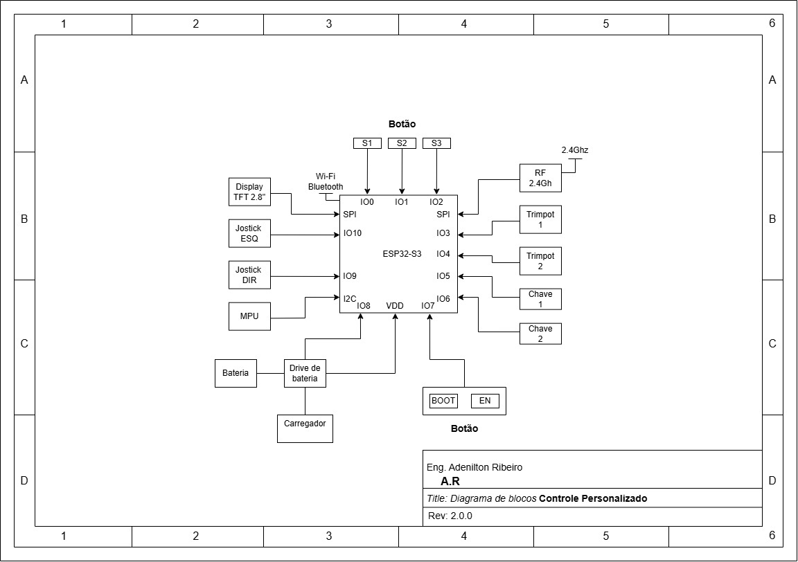

# _Hardware Controle_

---

## Sumário

- [Histórico de Versão](#histórico-de-versão)
- [Resumo](#resumo)
- [Arquivos de fabricação](#arquivos-de-fabricação)
- [3D](#3d)
- [Cabeçalho do Projeto](#cabeçalho-do-projeto)
- [Links para estudos e datasheet](#links-para-estudos-e-datasheet)
- [Diagrama de Bloco](#diagrama-de-bloco)
- [Pinos do projeto eletrônico](#pinos-do-projeto-eletrônico)
- [Explicação dos módulos eletrônico](#explicação-dos-módulos-eletrônico)
  - [Nome do módulo](#nome-do-módulo)
  - [Componentes Gerais](#componentes-gerais)
- [Informações do Software](#informações-do-software)

## Histórico de versão

| Versão | Data       | Autor        | Descrição            |
|--------|------------|--------------|----------------------|
| 1.0.0  | 18/08/2025 | Adenilton R  | Início do Projeto    |

## Resumo

Este projeto consiste no desenvolvimento de um controle personalizado completo, abrangendo o design de hardware, firmware e integração de sistemas embarcados, utilizando o microcontrolador ESP32-S3 como unidade principal de processamento.

O hardware foi projetado para oferecer uma interface rica ao usuário, incluindo botões táteis, potenciômetros, joysticks analógicos, chaves de seleção e um display LCD touch de 2.8” com interface gráfica baseada em LVGL. Além disso, o sistema incorpora um sensor inercial (MPU) para detecção de movimento e orientação.

A arquitetura de energia foi desenvolvida visando robustez e eficiência, utilizando uma ou duas células de bateria Li-ion 18650. O gerenciamento de energia é realizado pelo MAX77960, responsável pelo controle de carga, distribuição de energia (power path) e alimentação do sistema. Para monitoramento preciso da bateria, é utilizado o MAX17205, permitindo a medição avançada de parâmetros como nível de carga (%), corrente, tensão, tempo restante e estado de saúde da bateria.

O sistema suporta múltiplas interfaces de comunicação, incluindo USB, Bluetooth BLE, Wi-Fi e rádio frequência na faixa de 2.4 GHz, possibilitando sua aplicação em controle de robôs, drones, sistemas de automação e simuladores de voo em PC.

## Arquivos de fabricação

**`nome_do projeto_v1.0.0`**

## 3D

⚙️**Confira a versão ao vivo!**

`[Gif]`

Top:

`[Adicionar uma imagem frente e verso]`

Bottom:

`[Adicionar uma imagem frente e verso]`

## Cabeçalho do Projeto

`[Adicionar uma imagem]`

## Links para estudos e datasheet

`Link`para adicionar

`Link`para adicionar

## Diagrama de Bloco

Este é o diagrama do projeto eletrônico, onde estarão contidos todos os circuitos necessários para o funcionamento adequado.

## Pinos do projeto eletrônico

`[Adicionar uma imagem]`

`Esquemático eletrônico - KiCad.`

## Explicação dos módulos eletrônico

### Nome do módulo

[Fazer descrição]

`[Adicionar uma imagem]`

Esquemático eletrônico:

`[Adicionar uma imagem]`

**Informações Técnicas:**

- `Tensão de operação:` 3,3V - 5V;
- `Chip:` DS3231;

**Pinos do projeto:**

| Nome | Pino |
|------|------|
| SDA  | D21  |
| SCL  | D22  |

**Documetação:**

`Link` de compra do módulo.

`Link` do datasheet.

**Informações para KiCad:**

    
Nome_do_componente

      
    Palavras-Chave:
    Reference:
    Value:
    Footprint:
    Datasheet:
    Description:
    Site:
    MPN:
    Notes:
    Manufacturer:
    MFR Part #:
    JLCPCB Part #:
    Package:
    Source:
    Assembly Type:
    CAD Model:
    ECCN:

Informações
Link de arquivos do nome:
[SnapEDA](https://www.snapeda.com/parts/SS34/Taiwan%20Semiconductor/view-part/?ref=search&t=ss34)

### Componentes Gerais

  
Nome:

  **Informações Técnicas:**

  - `Tensão de operação:` 3,3V - 5V;
  - `Chip:` DS3231;

  **Documetação:**

  Compra do módulo.
  Compra BR.
  Datasheet.

  **Informações para KiCad:**

  

    
Nome:

    Palavras-Chave:
    Reference:
    Value:
    Footprint:
    Datasheet:
    Description:
    Site:
    MPN:
    Notes:
    Manufacturer:
    MFR Part #:
    JLCPCB Part #:
    Package:
    Source:
    Assembly Type:
    CAD Model:
    ECCN:

  

  Informações
  Link de arquivos do nome:
  [SnapEDA](https://www.snapeda.com/parts/SS34/Taiwan%20Semiconductor/view-part/?ref=search&t=ss34)

    
## Informações do Software

| Info             | Modelo           |
|------------------|------------------|
| KiCad            | 10.0.1           |

