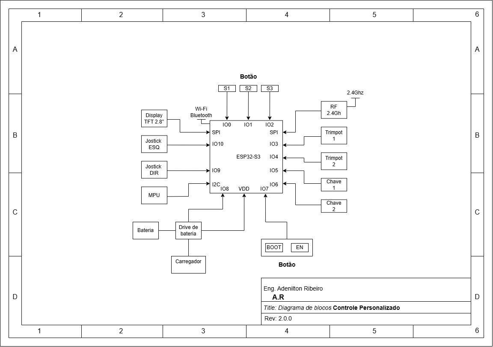

# _Controle Personalizado_

---

## Sumário

- [Histórico de Versão](#histórico-de-versão)
- [Boas Práticas para Commits](#boas-práticas-para-commits)
- [Resumo](#resumo)
- [Objetivo](#objetivo)
- [Requisitos](#requisitos)
- [Informações Adicionais](#informações-adicionais)
    - [Diagrama de Bloco](#diagrama-de-bloco)
    - [Hardware](#hardware)
    - [Firmware](#Firmware)
    - [Cad](#cad)

## Histórico de Versão

| Versão | Data       | Autor        | Descrição            |
|--------|------------|--------------|----------------------|
| 1.0.0  | 11/09/2024 | Adenilton R  | Início do Projeto    |

---

## Boas Práticas para Commits

Para manter um histórico de commits organizado, siga as seguintes
diretrizes:

- **`feat:`** (novo recurso para o usuário, não uma nova
funcionalidade para script de construção)
- **`fix:`** (correção de bug para o usuário, não uma correção
para um script de construção)
- **`docs:`** (alterações na documentação)
- **`style:`** (formatação, falta de ponto e vírgula, etc;
nenhuma alteração no código de produção)
- **`refactor:`** (refatoração do código de produção, por
exemplo, renomeação de uma variável)
- **`test:`** (adicionando testes ausentes, refatorando testes;
sem alteração no código de produção)
- **`chore:`** (atualizando tarefas pesadas, etc; nenhuma
alteração no código de produção)

---

## Resumo

Projeto de um controle personalizado utilizando o microcontrolador ESP32-S3, incluindo design de hardware em CAD, firmware dedicado e integração de componentes como display, botões táteis, potenciômetro, chaves, entradas analógicas e módulo de rádio controle 2.4 GHz. Ideal para aplicações em automação, robótica e projetos DIY, oferecendo um dispositivo versátil e personalizável para controle remoto.

## Objetivo

Desenvolver um controle remoto personalizado e versátil, utilizando o microcontrolador ESP32-S3, que combine múltiplos tipos de entrada (digitais e analógicas) e comunicação sem fio para aplicações diversas em automação, robótica e projetos DIY. O projeto visa criar um dispositivo robusto, eficiente e fácil de personalizar, atendendo às necessidades de controle remoto preciso e confiável em diferentes contextos.

## Requisitos

1. **Hardware:**
   - Microcontrolador ESP32-S3 com suporte para Wi-Fi e Bluetooth.
   - Display integrado (LCD, OLED, ou similar) para exibição de informações.
   - Botões táteis para entrada digital.
   - Potenciômetro para controle analógico.
   - Chaves para seleção de modos e funções.
   - Dois controles analógicos (joysticks ou similares).
   - Módulo de rádio controle de 2.4 GHz para comunicação sem fio.
   - Fonte de alimentação compatível (bateria recarregável ou adaptador de corrente).
   - Componentes de suporte (resistores, capacitores, conectores, etc.).

2. **Software:**
   - Firmware para ESP32-S3 desenvolvido em C/C++ usando a ESP-IDF (Espressif IoT Development Framework).
   - Drivers para o display, botões, potenciômetro, e comunicação via rádio.
   - Biblioteca de controle de comunicação (Wi-Fi, Bluetooth e rádio controle).
   - Interface de usuário básica para o display.

3. **Ferramentas de Desenvolvimento:**
   - Ambiente de desenvolvimento compatível (Espressif IDE ou VS Code com extensões para ESP-IDF).
   - Ferramentas CAD para design de PCB (como KiCad, Altium Designer, ou Eagle).
   - Ferramentas para impressão 3D, se necessário, para o design do case.

4. **Documentação:**
   - Manuais de montagem e uso.
   - Instruções de configuração de firmware e software.
   - Esquemas elétricos e layouts de PCB.

## Informações Adicionais

### Diagrama de Bloco

Este é o diagrama do projeto eletrônico, onde estarão contidos todos os circuitos necessários para o funcionamento adequado.

### Hardware

⚙️**Confira a versão ao vivo!**

Para obter mais informações sobre o projeto Eletrônico, clique no [**link**](https://github.com/AdeniltonR/Controle-personalizado/tree/main/Hardware) a seguir.

`[Adicionar uma foto ou Gif]`

### Firmware

Para obter mais informações sobre o projeto do Firmware, clique no [**link**](https://github.com/AdeniltonR/Controle-personalizado/tree/main/Firmware) a seguir.

`[Adicionar uma foto ou Gif]`

### Cad

Para obter mais informações sobre o projeto de Cad, clique no [**link**](https://github.com/AdeniltonR/Controle-personalizado/tree/main/Cad%203D) a seguir.

`[Adicionar uma foto ou Gif]`